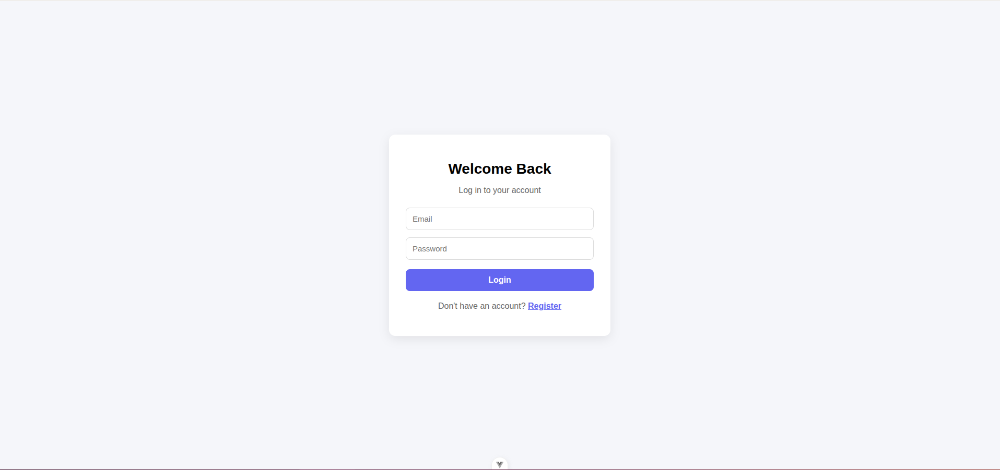
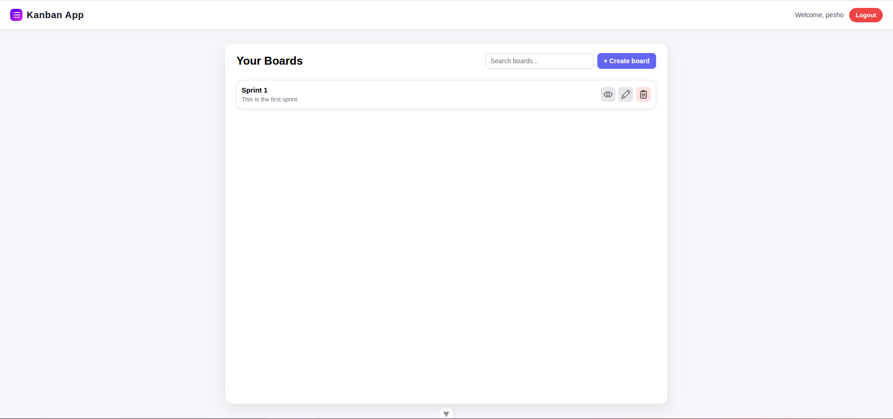
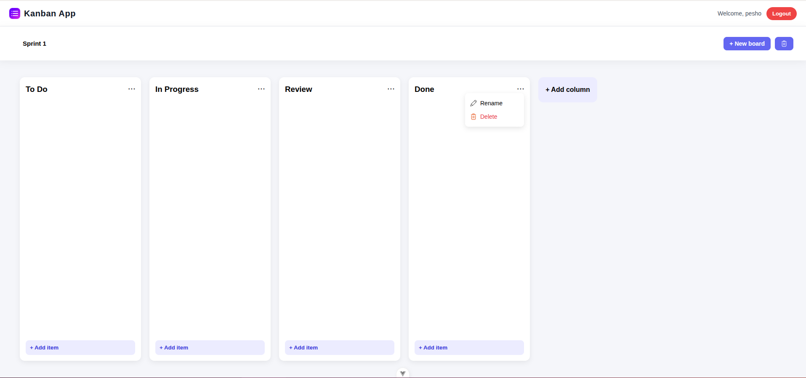
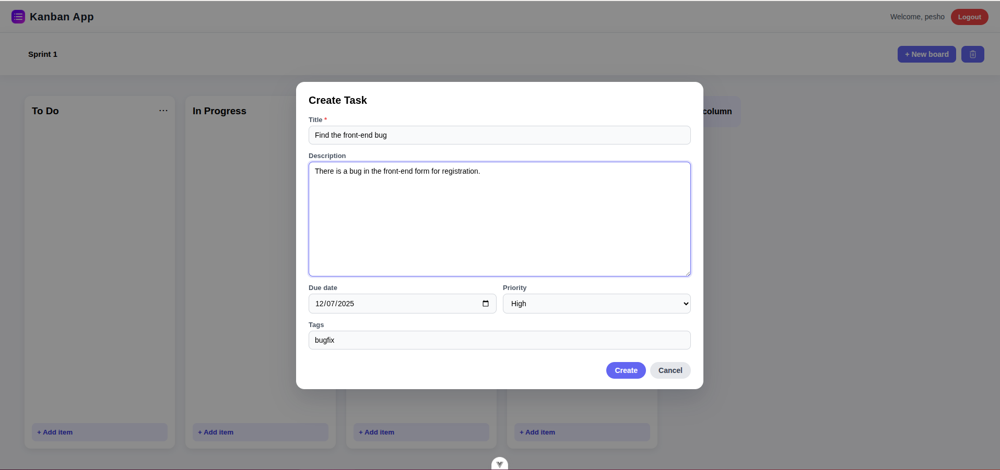

# 🧩 Kanban Task Management System  
A full-featured **Kanban board application** built using **Laravel (REST API)** + **Vue 3 (Vite)** + **MySQL 8** — fully containerized with Docker.
Users can create boards, add columns (lists), manage tasks, reorder them using drag-and-drop, attach files, and view detailed task information in a modern UI.

---

## 🚀 Tech Stack

Frontend: Vue 3, TypeScript, Vite

Backend: Laravel 12 (REST API)

Database: MySQL 8

Authentication: Laravel Sanctum

Storage: Laravel Storage

Deployment: Docker + Docker Compose

---

## 🌍 Features

### ✔️ Boards
- Create / view / edit / delete boards  
- Real-time search filtering  
- UI optimized for multiple boards

### ✔️ Columns (Lists)
- Add, rename, delete columns  
- Columns update instantly without refresh  
- Each column contains independent task list  

### ✔️ Tasks
- Create / edit / delete tasks  
- Fields: title, description, priority, due date, tags  
- TaskDetails modal with full info  

### ✔️ Drag & Drop (Kanban style)
- Move tasks within a column  
- Move tasks between columns  
- Order and column change persist in DB automatically  

### ✔️ Attachments
- Upload files via file picker  
- Stored in `storage/app/public/attachments`  
- Listed with filename + open + delete  
- Auto preview through public storage URL  

---

## 📸 Application Walkthrough (Screenshots)

### 1. Login page  
  
User enters email + password and is redirected to their boards. If user don't have an acount he can make a registration.

---

### 2. Boards page — empty state  
  
No boards yet → Call-to-action encourages first creation.

---

### 3. Boards page — with user boards  
  
Shows existing boards with **title + description**.  
Buttons: View • Edit • Delete  
Search bar filters boards live.

---

### 4. Default board view  
  
Opened board displaying columns visually.  
User can add new columns and create tasks inside them.

---

### 5. Column editing  
  
Menu `⋯` allows rename + delete.  
Changes update UI instantly, no refresh required.

---

### 6. Create Task  
  
Modal with fields:

- Title  
- Description  
- Priority  
- Due date  
- Tags  

---

### 7. Drag & Drop between columns  
  
Tasks can be **dragged and dropped** between them and between columns.  

---

### 8. Task Details + Attachments  
  

- Full details panel (title, description, priority, tags, due date)  
- Edit / Delete task from menu  
- Attachment support:
  - Upload files
  - Preview / open
  - Delete

---

## 🔧 Setup & Installation

(coming next)

---

## 🔥 Author  
Built by **Kiril** — aspiring full-stack developer with passion for clean UI & modern architecture.  